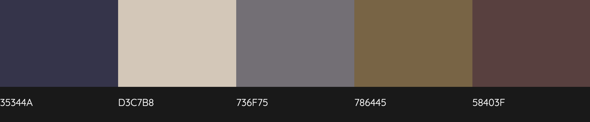
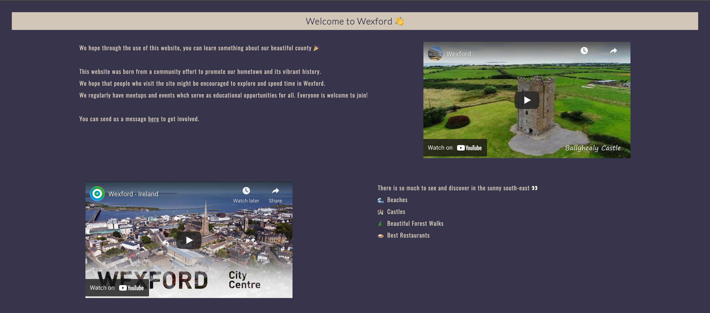

# Wexford History

* 💻 [Deployed Site](https://sarahjameson.github.io/wexford-history/index.html)
* 🗂 [GitHub Repository](https://github.com/sarahjameson/wexford-history)

## About

This website was created to encourage people to explore Wexford. It hopes to show people that history can be fun and accepted of all people. History can be an imtimidating subject and people can become relucant to learn much about it because it can appear dated and guarded. Wexford's history is for everyone and can combine with many other fun activities such as a pub crawl or a crazy trad music night!

## Table of Contents

- [Wexford History](#wexford-history)
  * [About](#about)
  * [Table of Contents](#table-of-contents)
  * [UX Experience](#ux-experience)
    + [User Stories](#user-stories)
    + [Design](#design)
  * [Features](#features)
  * [Technologies Used](#technologies-used)
    + [Languages Used](#languages-used)
    + [Libraries and Programs Used](#libraries-and-programs-used)
  * [Testing](#testing)
    + [Navigation Bar](#navigation-bar)
    + [Footer](#footer)
    + [External Links](#external-links)
    + [Gallery](#gallery)
    + [CSS3 Validator - Pass](#css3-validator---pass)
    + [HTML5 Validator](#html5-validator)
    + [Compatibility Testing](#compatibility-testing)
    + [Performance Testing](#performance-testing)
    + [Testing User Stories](#testing-user-stories)
  * [Deployment](#deployment)
    + [Publishing](#publishing)
    + [Forking](#forking)
    + [Cloning](#cloning)
  * [Known Bugs](#known-bugs)
  * [Credits](#credits)

## UX Experience

### User Stories

* As a visit who is looking to find new ways to spend their time
    - I want to understand the site and its purpose
    - I want to see a highight of different activities as a flavour of what the group do
    - I want handy links to some activities so I do not have to waste any time searching up the website

* A a visitor, looking for friends
    - I want to see that it is not just a tourist site
    - I want notice the friendly and welcoming nature of the site so I do not feel intimidated
    - I want to understand that there are different opportunties for socialising and learning at the same time

* As a visitor who wants to see what is in Wexford and understand it from a historical view
    - I want to see a brief overview of its history
    - I want to see a call-to-action so that I can act on the flavour of offering and join

### Design

* Colour Scheme
    - For this website, I took inspiration from a famous Wexford tapestry. You can read more about it [here](https://www.discoverireland.ie/wexford/the-ros-tapestry-exhibition-centre). I wanted the style of the page to not take away from the content so choose three of the colours rather than all five. The three I picked were: #35344A, #D3C7B8 and #786445.

* Typography
    - I used Google fonts for the copy
    - I used Lato for the headings. It is a fun font but also has a feeling of historical heritage
    - Oswald was used for the paragraph writings and links on the page. It is a fun, modern and stylist font which goes with the purpose of the page

* Imagery
    - Images on the page serve to show some of the highlights of Wexford. They aim to show the variety of things to see. I used royalty free images found from a search on [Unsplash.](https://unsplash.com/s/photos/wexford) The pictures are all so beautiful and really add some charm to the site. They are the spice to the site as the colour scheme is muted.

## Features

* Header
    - The header is at the top of the pages
    - The logo is positioned at the top and is visible on all pages
    - The logo acts as a home page as well
    - There is a hover effect and the mouse changes when hovered to indicate that it can be clicked
* Main
    - All pages have content which aims to be spread out and readable
    - T
* Footer
    - Footer is always at bottom of the pages
    - Social links are grouped together and spaced evenly between for ease on eyes
    - There is a call-to-action and a friendly emoji to encourge people to interact with the social media pages
* Landing page
    - Gives introduction to page's function so user is informed
    - Uses mix of media including photos, text and video to encourage engagement
    - Hero image provides an immediate visual engagement with user

* Future Features
    - Timelines of Wexford through the ages
    - Social media feed to show what is happening under Wexford hashtag
    - Way for people to 'like' posts on the site to encourge engagement

## Technologies Used

### Languages Used
* [HTML5](https://en.wikipedia.org/wiki/HTML5)
* [CSS3](https://en.wikipedia.org/wiki/CSS)

### Libraries and Programs Used
* [Font Awesome](https://fontawesome.com/) - Used for icons in footer
* [Google Fonts](https://fonts.google.com/) - Used for font selection and importation
* [Git](https://git-scm.com/) - Used for version control
* [GitHub](https://github.com/) - Used for hosting the website on GitHub Pages
* [TingJPG](https://tinyjpg.com/) - Used to lower the resolution of the images

## Testing
### Navigation Bar
* When each of the navigation links are clicked, they bring me to the right place
* All links are working and have been tested
* The navigation bar is at the top of the page

### Footer
* Footer is always at bottom of page
* If social media links are clicked, they open to the right platform
* They are centered

### External Links
* All eternal links open in new tab
* They open to the right page

### Gallery
* All images are responsive and stay visible to user

### CSS3 Validator - Pass
* See results [here](https://jigsaw.w3.org/css-validator/validator?uri=https%3A%2F%2Fsarahjameson.github.io%2Fwexford-history%2F&profile=css3svg&usermedium=all&warning=1&vextwarning=&lang=en)

### HTML5 Validator
* Landing Page - Fail - [Results](https://validator.w3.org/nu/?doc=https%3A%2F%2Fsarahjameson.github.io%2Fwexford-history%2F)
* History Page - Pass - [Results](https://validator.w3.org/nu/?doc=https%3A%2F%2Fsarahjameson.github.io%2Fwexford-history%2Fhistory.html)
* Gallery Page - Fail - [Results](https://validator.w3.org/nu/?doc=https%3A%2F%2Fsarahjameson.github.io%2Fwexford-history%2Fgallery.html)
* Contact Page - Fail - [Results](https://validator.w3.org/nu/?doc=https%3A%2F%2Fsarahjameson.github.io%2Fwexford-history%2Fform.html)

### Compatibility Testing
* It looks similar on different browsers. There were some differences on Safari but did not have time to make the changes. I will work on that in the future and make sure the site looks uniform on all browsers.
* I had some difficulty with the responsiveness of the site especially when it gets down to the mobile size. I want to make it responsive and suitable for all sizes. 

### Performance Testing
* Webpage Performance Testing was carried out with [WebPageTest](https://www.webpagetest.org/). The test location was set to Ireland the the browser was set to Chrome. There were some areas of improvement suggested such as security and cashe static content. I will look tp improve these in the future.
* Landing Page - [Results](https://www.webpagetest.org/result/210911_AiDc05_aad37a4138497a7c0f2d8271f5fcd537/)
* History Page - [Results](https://www.webpagetest.org/result/210911_AiDcPC_be5521bfc69e7b0bfa697863c8628ab3/)
* Gallery Page - [Results]()
* Conact Page - [Results]()

### Testing User Stories
* As a visit who is looking to find new ways to spend their time
    - I want to understand the site and its purpose
    The landing page is clear and the layout is flowing. There is a clear hierarchy and journey in the page that leads the user to discover the site's core purpose.
    - I want to see a highight of different activities as a flavour of what the group do
    The gallery page keeps a highlight of great things you can see in Wexford. The pictures are beautiful and display this activity. There is a description below each picture showing the name of the place or thing.
    - I want handy links to some activities so I do not have to waste any time searching up the website
    There is a link to a website with more information on the highlighted activity/places to see. The differing mouse pointer makes it evident that the user can click.

* A a visitor, looking for friends
    - I want to see that it is not just a tourist site
    The copy states clearly that it is a community effort made for both residents and tourists alike.
    - I want notice the friendly and welcoming nature of the site so I do not feel intimidated
    There is a very friendly communication style and emojis are used throughout to convey this.
    - I want to understand that there are different opportunties for socialising and learning at the same time
    The copy mentions that there are many different occassions for socialising
* As a visitor who wants to see what is in Wexford and understand it from a historical view
    - I want to see a brief overview of its history
    There is a history page that gives a brief overview of how Wexford came about
    - I want to see a call-to-action so that I can act on the flavour of offering and join
    There is a call-to-action at the footer page and also a form that calls for people to get in touch

## Deployment

### Publishing

This website was published using [GitHub Pages](https://pages.github.com/).

Instructions to use it:
* Go to the GitHub website and log in
* On the left-hand side, you'll see all your repositories, select the appropriate one
* Under the name of your chosen Repository you will see different options. Click on 'Settings' located on the right hand side
* Scroll down till you see 'GitHub Pages' heading
* Under the 'Source' click on the dropdown and select 'master branch'
* The page will reload and you'll see the link of your published page displayed under 'GitHub' pages
* It may take a minute for the site to be published. The link changes to a green color when it is ready

### Forking

If you want to contribute to this website. You can fork it.

Instructions to do this:
* Go to the GitHub website and log in
* Find the repository
* On the right-hand side of the Repository name, you'll see the 'Fork' button. It's located next to the 'Star' and 'Watch' buttons
* This will result in your own copy which you can make changes to
* After changes are made, you can use the 'New Pull Request" button above the file in the original repository

### Cloning

You can create a copy on your local device by cloning it.

Instructions to do this:
* Go to the GitHub website and log in
* Find the repository
* Under repository name, select green button with words 'Clone or Download'
* Use 'Clone with HTTPS' option
* Open terminal and go to directory you wish to clone into
* Type 'git clone' and paste HTTPS link that was given

## Known Bugs

The site's responsiveness is causing issues and has to be worked on. Also, the Safari site looks slightly different to the chrome one.

## Credits

* The history page copy was taken from [Visit Wexford](https://www.visitwexford.ie/historical-points-in-county-wexford-that-history-lovers-shouldnt-miss/)
* All the pictures were taken from a search on [Unsplash](https://unsplash.com/)
* Videos were found on [YouTube](https://youtube.com)
* I created the colour scheme with [Colormind](http://colormind.io/image/)
* A massive thank you to my mentor Maranatha who guided me to hand in a project when I didn't think I'd have time. I didn't manage to sort out the responsiveness but it's a good attempt considering where we were a few days ago
